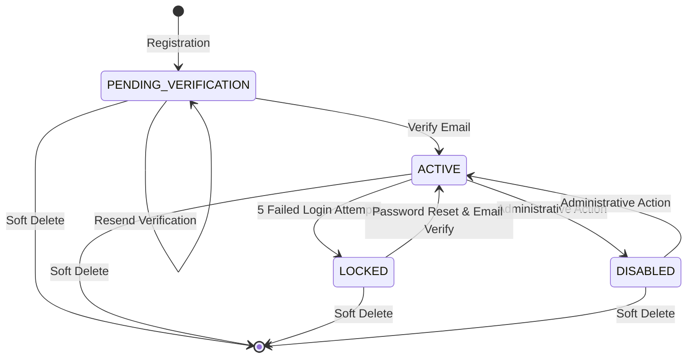

# Authentication State Machine

This document defines the lifecycle states and transition rules for user accounts in the ExpenseFlow application. Enforcing these constraints prevents invalid states or bypass vulnerabilities.

---

## 1. State Diagram

---

## 2. State Transition Matrix

The following table defines the allowed transitions. Any request attempting a state transition not explicitly listed below must be rejected by the business service layer:

| Source State | Trigger / Action | Target State | Description |
| :--- | :--- | :--- | :--- |
| `[*] (None)` | `User Registration` | `PENDING_VERIFICATION` | User registers an account. Password is encrypted; confirmation token is issued. |
| `PENDING_VERIFICATION` | `Email Token Validation` | `ACTIVE` | User opens the verification link before the 24-hour token expiry. |
| `PENDING_VERIFICATION` | `Token Expiration / Resend` | `PENDING_VERIFICATION` | Token expires; user triggers a new verification token request. |
| `ACTIVE` | `5 consecutive login failures` | `LOCKED` | Security threshold reached. `accountLockedUntil` is populated dynamically. |
| `ACTIVE` | `Admin Action / Violation` | `DISABLED` | The account is locked out indefinitely by system administrators. |
| `LOCKED` | `Lock Duration Expiry` | `ACTIVE` | Once current time exceeds `accountLockedUntil`, the login flow resets attempts to 0. |
| `LOCKED` | `Password Reset Validation` | `ACTIVE` | Resetting the password via email verification unlocks the account immediately. |
| `DISABLED` | `Admin Enablement` | `ACTIVE` | Administrative console re-activates the account. |
| `ANY STATE` | `User Deletion / Purge` | `isDeleted = true` | The record is soft-deleted. Hibernate filters will exclude it from all active queries. |

---

## 3. Core Business Rules
1. **Login Block:** Accounts in the `PENDING_VERIFICATION`, `LOCKED`, or `DISABLED` states must be rejected immediately during the login credentials validation step.
2. **Progressive Locks:** Locked state durations are computed progressively:
   - Attempt 5: 30 minutes.
   - Attempt 6+: Lock duration doubles (2 hours, 12 hours, 24 hours, then forces password reset).
3. **Session Revocation:** Transitioning to `LOCKED`, `DISABLED`, or resetting a password must immediately revoke all refresh tokens associated with that user to force instant logout across all devices.
