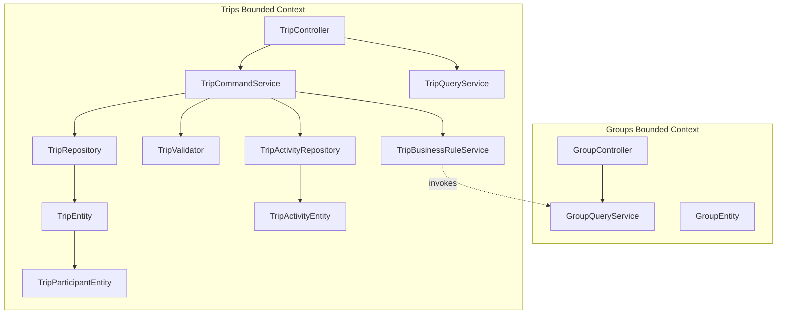
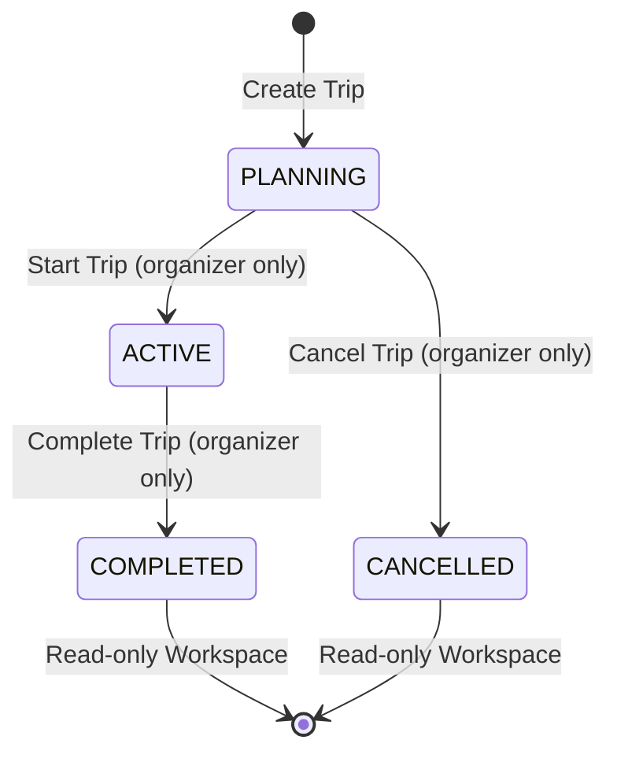
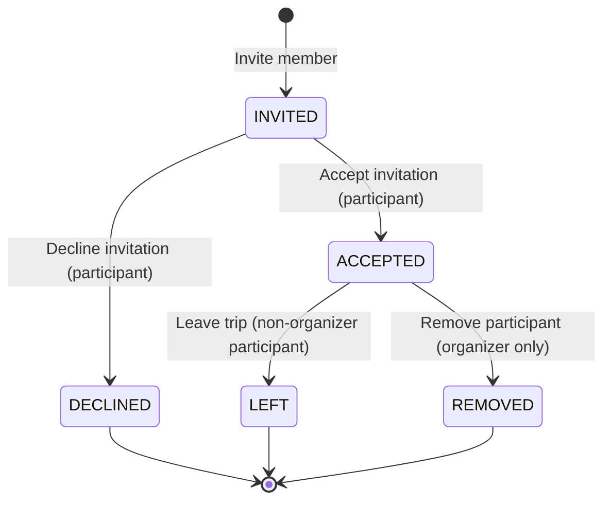

# Trips Bounded Context: Architecture Diagrams

This document contains Mermaid diagrams visualizing the architecture, context map, and state machines for the Trips bounded context (Sprint 05).

---

## 1. Context Map & Monolith Communication Boundary

As defined in **ADR-002**, there are no direct database dependencies or repository injections between the `Groups` and `Trips` contexts. Cross-context validation is performed via services.

---

## 2. Trip Lifecycle State Machine

A trip progresses through a series of mutually exclusive status states. Once a trip is `COMPLETED` or `CANCELLED`, it becomes read-only and no further state transitions or metadata modifications are permitted.

---

## 3. Participant Lifecycle State Machine

Participant states are scoped inside the Trip aggregate. Status transitions are managed via `ParticipantCommandService` mutations.

